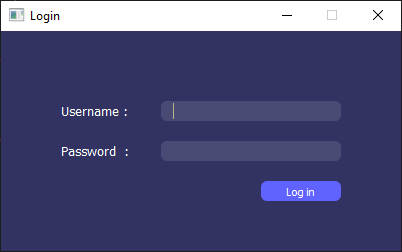
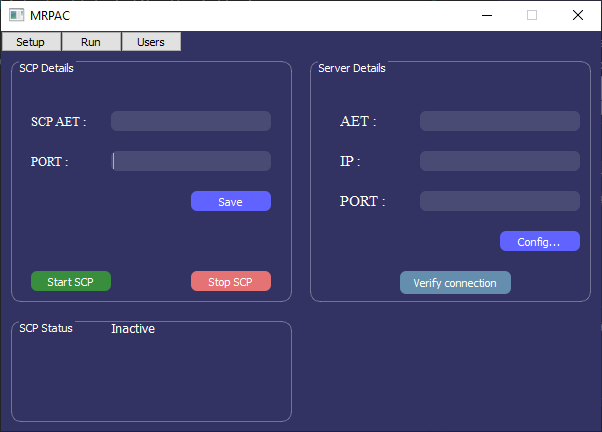
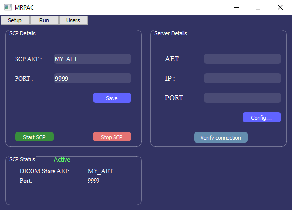
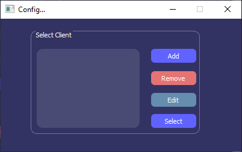
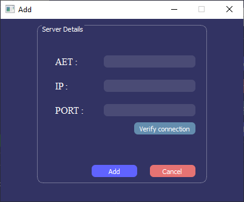

# MRPAC
## A desktop application program for autocontouring DICOM images sent over a DICOM Network.

MRPAC is written in python and it automatically contours DICOM images that are sent to it over a [DICOM](https://www.dicomstandard.org/) communication protocol. It converts the autocontour results as [`DICOM RT Structure Set`](https://dicom.nema.org/medical/dicom/current/output/chtml/part03/sect_A.19.3.html#table_A.19.3-1) and sends them to a pre-configured DICOM location. 

## Installation
To install MRPAC, I suggest you create a separate virtual environment first. Then simply clone the repository (or download the zip file) and run the following command in your terminal/command prompt: 
```bash
pip install .
``` 

If you would like to use our models that were trained on MR images of the pelvis from a 0.35T scanner, you can download them from [here](https://drive.google.com/drive/folders/1jiswRsa59ADvz7HG5iFQ_KxpS1M2I_zW?usp=drive_link). You must create a directory called models and copy all the models into that directory. The details about the models can be found [here](https://github.com/YAAbdulkadir/MRPelvisAutoContouring). If you have your own models that you would like to use, follow the instruction below.

`MRPAC` can also use [TotalSegmentator](https://github.com/wasserth/TotalSegmentator) to autocontour CT images. However, you need to install pytorch and `totalsegmentator` separately. If your device is GPU enabled, I highly recommend installing `PyTorch` first followed by totalsegmentator. If you are using windows for example:
```
pip install torch torchvision torchaudio --index-url https://download.pytorch.org/whl/cu118
pip install TotalSegmentator
``` 
More information (including instructions for other operating systems) can be found on the [PyTorch](https://pytorch.org/get-started/locally/) website.

You can verify the installation by importing `mrpac` from the console.
```python
>>> import mrpac
>>> mrpac.VERSION
'1.6.1
```

## Starting MRPAC
You can start `MRPAC` either from the command line or in a python console (script).
- From the command line:
```bash
mrpac
```
- From a python console (script):
```
>>> from mrpac.MRPAC import start
>>> start()
```

## Configuration
When you run the progrom, you will be prompted to login. The default username and password are Admin and mrpac respectively (The feature to add or modify users is not implemented yet). 



After you successfully login, you will see the `Setup` window which should look like the following:



In the SCP Details section, you can type in the AE title you would like to use for this program. (Make sure it complies with the DICOM standard as specified [here](https://dicom.nema.org/medical/dicom/current/output/html/part08.html#chapter_C)). You alse need to choose a port number (choose a port above 1024 that is not being used by other programs). You can save your AE title and port number so that the next time you run the program, it remembers. When you click on the Start SCP button, the server will be started and will start listening for DICOM communications with the specified AET and port number. Once active, the SCP Status will change to `Active` as shown below.



It does support a DICOM [C-ECHO](https://dicom.nema.org/medical/dicom/current/output/chtml/part07/sect_9.3.5.html) so you can try and verify that other DICOM applications are able to communicate with your program. Now your program is configured to accept DICOM images that are sent to it and generate the autocontours. To automatically send the DICOM [RTStruct](https://dicom.nema.org/dicom/2013/output/chtml/part03/sect_A.19.html) that is generated by this program to a DICOM location (such as a PACS), you need to add the information of the DICOM location in the `Server Details` section by clicking on the `Config...` button. This will take you to a new window which should look like this.



You can add multiple DICOM locations in here and they will be saved, however, you can only select one DICOM location to send the `RTStruct` files to. In order to add a DICOM location, you simply click on the `Add` button which will take you to the `Add window`.

.

You can add the details of the DICOM location in here and click on `Verify connection` to verify the connection by sending a DICOM C-ECHO message before adding it. Once you have successfully added as many DICOM locations as you like, you can select one of them where the `RTStruct` will be sent to.

## Using your own models
If you have your own autocontouring models that you would like to use instead, you can modify `Autocontour.py`. You can follow a similar structure and implement the `__init__` method and the `run` method. If you change the structure of the `Autocontour` class, you might have to modify `MRPAC.py` to make sure that it is being instantiated and run correctly in the `handle_close` function. 

## UID specification
The program uses the [`pydicom.uid.generate_uid`](https://pydicom.github.io/pydicom/dev/reference/generated/pydicom.uid.generate_uid.html) function to generate the `SeriesInstanceUID` and the `SOPInstanceUID` for the new `RTStruct` object being created. More information on DICOM UIDs can be found [here](https://dicom.nema.org/dicom/2013/output/chtml/part05/chapter_9.html). By default, the program uses the `pydicom` root UID as a prefix saved in the `uid_prefix.txt` file in the `resources` directory. If you have your own unique UID prefix, you can update the `uid_prefix.txt` so the program can use it. If you delete the `uid_prefix.txt` file, for the `prefix` parameter of the `generate_uid` function, `None` will be passed and the function generates a UID using the `uuid.uuid4()` algorithm. You can also modify the `RTstruct.py` if you would like to use your own UID suffix generation method.

## Development
You can also re-create the development environment from the `mrpac_dev.yml` file using the following commands:
```bash
conda env create -n mrpac_dev --file mrpac_dev.yml
```

## References
If you use our models, please cite our [`Medical Physics paper`](https://aapm.onlinelibrary.wiley.com/doi/full/10.1002/mp.16676).
> **Abdulkadir, Y, Luximon, D, Morris, E, et al. Human factors in the clinical implementation of deep learning-based automated contouring of pelvic organs at risk for MRI-guided radiotherapy. Med Phys. 2023; 50: 5969–5977. https://doi.org/10.1002/mp.16676**

Please also cite [TotalSegmentator]() if you use it for CT segmentations.
> **Wasserthal, J., Breit, H. C., Meyer, M. T., Pradella, M., Hinck, D., Sauter, A. W., ... & Segeroth, M. (2023). Totalsegmentator: Robust segmentation of 104 anatomic structures in ct images. Radiology: Artificial Intelligence, 5(5).**

## Contacts
If you have any questions or suggestions, please contact me at YasinAAbdulkadir@gmail.com
